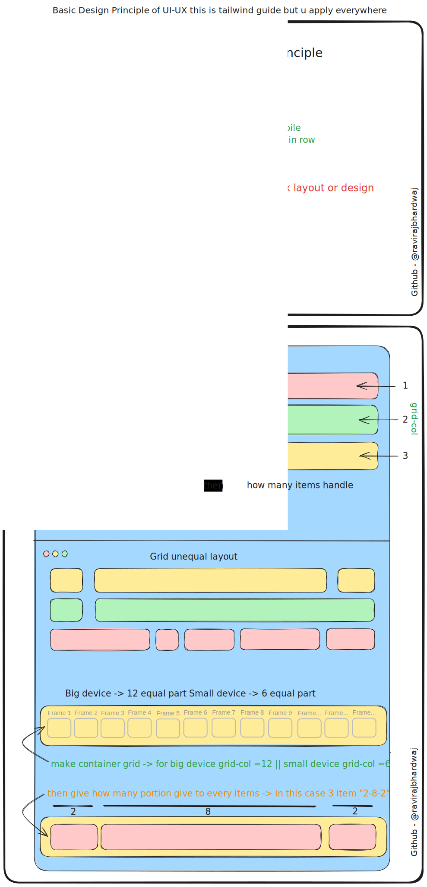
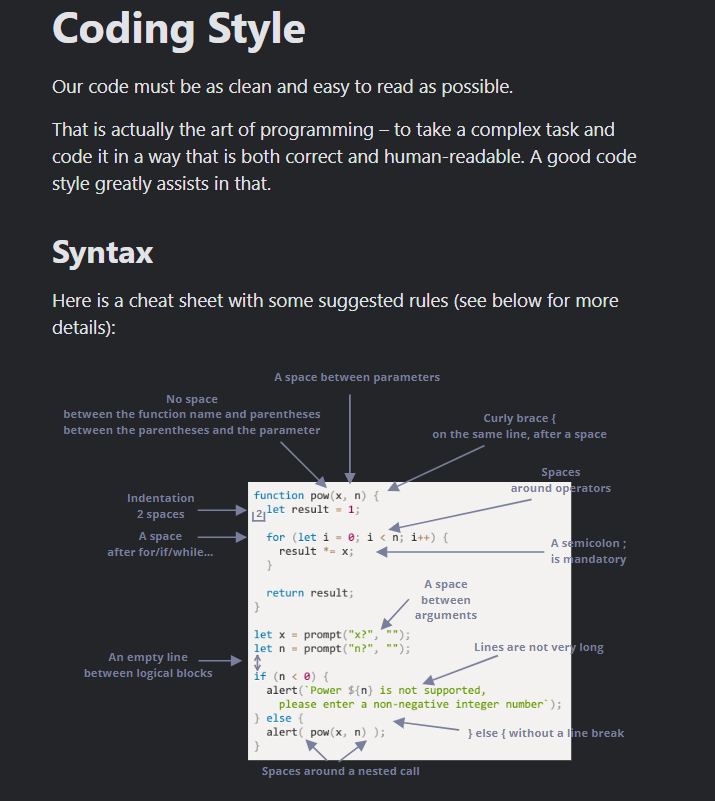

# HTML

### HTML Elements & Tags

### Header
- `<header>`: Defines a header for a document or section.
- `<h1>` to `<h6>`: Heading elements 
- `<nav>`: Navigation links.

### Navigation
- `<nav>`: Navigation links.
- `<a>`: Hyperlinks to other pages or content.
- `<ul>`, `<ol>`, `<li>`: Lists of items, often used for navigation menus.

### Main Content
- `<main>`: The main content of the document.
- `<section>`: Sections of content within `<main>`.
- `<article>`: A self-contained composition in a document that is independently distributable or reusable.
- `<p>`: Paragraphs.
- `pre`: Preformatted text.
- ``: Images.
- `<video>`: Video files.
- `<audio>`: Audio files.
- `<canvas>`: Used for drawing graphics via scripting.

### Article
- `<article>`: A self-contained composition.
- `<h1>`, `<h2>`, ... `<h6>`: Headings within the article.
- `<p>`: Paragraphs.
- `<figure>`: Images, diagrams, photos, code listings, etc., that are referenced in the main flow of an article.
- `<figcaption>`: A caption or legend describing the figure.

### Aside
- `<aside>`: Content tangentially related to the content around the aside element.
- `<ul>`, `<ol>`: Lists that might summarize other content or link to related content.

### Figure
- `<figure>`: Self-contained content, frequently referenced as a single unit from the main content.
- `<figcaption>`: Caption that provides a description of the figure.

### Form
- `<form>`: Interactive controls for submitting information.
- `<input>`: Input fields.
- `<label>`: Labels for `<input>` elements.
- `<button>`: Buttons.
- `<select>`, `<option>`: Dropdown lists.
- `<textarea>`: Multi-line text input.
- `<fieldset>`: Groups related elements within a form.
- `<legend>`: Caption for the content of its `<fieldset>`.
- `<datalist>`: Specifies a list of pre-defined options for input controls.
- `<output>`: Defines the result of a calculation.

### Table
- `<table>`: Table element.
- `<thead>`: The header content of the table.
- `<tbody>`: The body content of the table.
- `<tfoot>`: The footer content of the table, often used for summarizing the data.
- `<tr>`: Table row.
- `<th>`: Table header cell.
- `<td>`: Table data cell.
- `<caption>`: Title or explanation for the table.

### Footers
- `<footer>`: Defines a footer for a document or section.

### HTML Attributes

1. **accept**: File Type Specification
2. **autocomplete**: Autocomplete Functionality
3. **capture**: Media Capture from Device
4. **crossorigin**: CORS Configuration
5. **dirname**: Text Direction Submission
6. **disabled**: Non-Interactive Element
7. **elementtiming**: Performance Monitoring
8. **for**: Label Association
9. **max**: Maximum Value Specification
10. **maxlength**: Character Limit
11. **min**: Minimum Value Specification
12. **minlength**: Minimum Character Requirement
13. **multiple**: Allow Multiple Values
14. **pattern**: Input Validation with Regex
15. **placeholder**: Input Hint
16. **readonly**: Non-Editable Field
17. **rel**: Document Relationship
18. **required**: Mandatory Field
19. **size**: Visible Width Specification
20. **step**: Legal Number Intervals

### Global Attributes

1. **accesskey**: Keyboard Shortcut Hint
2. **anchorExperimentalNon-standard**: Non-Standard Features
3. **autocapitalize**: Text Capitalization Control
4. **autofocus**: Automatic Focus on Load
5. **class**: CSS Class Specification
6. **contenteditable**: Editable Content Indicator
7. **data-***: Custom Data Storage
8. **dir**: Text Directionality
9. **draggable**: Dragging Capability
10. **enterkeyhint**: Enter Key Function Hint
11. **exportparts**: Expose CSS Shadow Parts
12. **hidden**: Element Relevance Status
13. **id**: Unique Identifier
14. **inert**: Non-Focusable Element
15. **inputmode**: On-Screen Keyboard Hint
16. **is**: Custom Behavior Attachment
17. **itemid, itemprop, itemref, itemscope, itemtype**: Microdata Metadata Attributes
18. **lang**: Language Specification
19. **nonce**: Security Token for Scripts
20. **part**: Style Encapsulation
21. **popover**: UI Enhancement Attribute
22. **slot**: Shadow DOM Slot Assignment
23. **spellcheck**: Spelling and Grammar Check
24. **style**: Inline CSS Styling
25. **tabindex**: Keyboard Navigation Control
26. **title**: Advisory Information
27. **translate**: Content Translation Specification

### Input Types

1. **button**
3. **color**
4. **date**
5. **datetime-local**
6. **email**
7. **file**
8. **hidden**
9. **image**
10. **month**
11. **number**
12. **password**
13. **radio**
14. **range**
15. **reset**
16. **search**
17. **submit**
18. **tel**
19. **text**
20. **time**
21. **url**
22. **week**

### References

- [MDN Web Docs](https://developer.mozilla.org/)

---

# CSS

## CSS Guide for Frontend Developers not for Designers

### FONTS & TEXTS or TYPOGRAPHY

1. `text-align` - Aligns text horizontally within an 
```css
text-align : left / right / center;
```
2. `text-decoration` - Adds decoration to text (like underline, line-through).
```css
text-decoration : none / underline / overline / line-through;
```
3. `font-weight` - Sets the weight (or thickness) of the font.
```css
font-weight : normal / bold / bolder / lighter / 100 - 900;
```
4. `font-family` - Specifies the font for the text.
```css
font-family : Arial, sans-serif;
```
5. `text-transform` - Controls the capitalization of text.
```css
text-transform : none / capitalize / uppercase / lowercase;
```
6. `line-height` - Controls the space between lines of text.
```css
line-height : 2px / 2em / 2% / 2;
line-height : normal;
```
7. `font-size` - Defines the size of the font.
```css
font-size : 12px / 1em / 100%;
```
8. `font-style` - Specifies the style of the font (e.g., italic).
```css
font-style : normal / italic / oblique;
```
9. `text-shadow` - Adds shadow to text.
```css
text-shadow : 1px 1px 1px #000;
```
10. `letter-spacing` - Controls the space between characters.
```css
letter-spacing : 2px;
```
11. `word-spacing` - Controls the space between words.
```css
word-spacing : 2px;
```

---
### BOX MODEL


- **Margin**
- **Padding**
- **Border**
- **Width**
- **Height**

```css
.box {
    -- clockwise --
    margin: 10px;  // margin: 10px 20px 30px 40px;  
    padding: 10px; // padding: 10px 20px 30px 40px;
    border: 1px solid #000;
    width: 100px/ 100% etc;
    height: 100px / 100% etc;
}
```

### COLORS 

- **HEX** `#000000`
```css
p {
    color: #000000;
}
```
- **RGB** `rgb(0, 0, 0)`
```css
p {
    color: rgb(0, 0, 0);
}
```
BONUS TIP:

- **Hue**: A pure color
- **Tint**: A pure color with
just white added
- **Shade**: a pure color with
just black added
4
- **Tone**: A pure color with
just grey added

### CSS UNITS

- **Absolute Units**
    - `in` - inches
    - `px` - pixels
    - `pt` - points
- **Relative Units**
    - `em` - relative to the font-size of the element
    - `rem` - relative to the font-size of the root element
    - `vw` - relative to 1% of the width of the viewport
    - `vh` - relative to 1% of the height of the viewport

### DISPLAY

- **inline** - Takes only the space required by the element. (no margin/ padding)
- **block** - Takes full space available in width.
- **inline-block** - Similar to inline but we can set margin & padding.
- **none** - To remove element from document flow.

```css
.box {
    display: inline / block / inline-block / none;
}
```

### POSITION

- **static** - Default position.
- **relative** - Relative to its normal position.
- **absolute** - Relative to the nearest positioned ancestor.
- **fixed** - Relative to the viewport.
- **sticky** - Based on user's scroll position.

```css
.box {
    position: static / relative / absolute / fixed / sticky;
}
```
- **z-index** - Specifies the stack order of an element.
```css
.box {
    z-index: 1;
}
```

### FLEXBOX & GRID
- **Flexbox** - For one-dimensional layout.
Reference: [Flexbox](https://css-tricks.com/snippets/css/a-guide-to-flexbox/)


- **Grid** - For two-dimensional layout.
Reference: [Grid](https://css-tricks.com/snippets/css/complete-guide-grid/)


### DESIGN PRINCIPLES MOBILE FIRST & RESPONSIVE DESIGN FOR ALL DEVICES



### CSS Library and Framework

http://tailwindcss.com/

https://ui.shadcn.com/

https://daisyui.com/

 https://react-spectrum.adobe.com/

https://shoelace.style/

https://mui.com/

PRO - https://ant.design/
# JavaScript 



### Essential Web APIs to Learn basic only then move on to Library and Framework

- **Graphics and Visualization or Document Manipulation**
    - DOM API : Connects web pages to scripts.
    - HTML DOM : Represents web pages.
    - History API : Manipulates browser history.
    - Canvas API  : Creates 2-D graphics and animations.
    - SVG : Handles scalable vector graphics.
    
    Alternative :
    
     Libraries and Frameworks   ⇒ React js, Fabric js , Snap svg
    
- **Network and Communication**
    - Fetch API : Performs network requests.
        
        Alternative → https://axios-http.com/docs/intro
        
    - Web Sockets API : Handles persistent connections for real-time communication
        
         Alternative → https://socket.io/ 
        
    - WebRTC : Handles real-time audio/video communication.
- **User Interaction and Notifications**
    - Geolocation API : Accesses user location data.
        
         https://leafletjs.com/ 
        
        https://mapsplatform.google.com/
        
    - Web Notifications API : Displays notifications.
        
        https://onesignal.com/
        
    - Pointer Events : Handles pointer events.
- **Storage and Data Management**
    - Web Storage API : Manages client-side storage.
- **Audio/Video and Media**
    - Audio/Video APIs : Handles audio and video processing.
    - Web Audio API : Processes and synthesizes audio.
    - WebRTC
        - Media Capture and Streams
        - MediaStream Recording

# **How to make Web App**

**User Interface** - how users will consume and interact with your application.

**Routing** - how users navigate between different parts of your application.

**Data Fetching** - where your data lives and how to get it.

**Rendering** - when and where you render static or dynamic content.

**Integrations** - what third-party services you use (for CMS, auth, payments, etc.) and how you connect to them.

**Infrastructure** - where you deploy, store, and run your application code (serverless, CDN, edge, etc.).

**Performance** - how to optimize your application for end-users.

**Scalability** - how your application adapts as your team, data, and traffic grow.

**Developer Experience** - your team's experience building and maintaining your application.